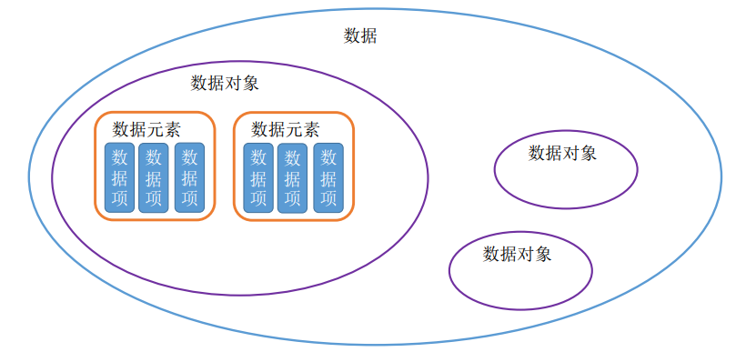
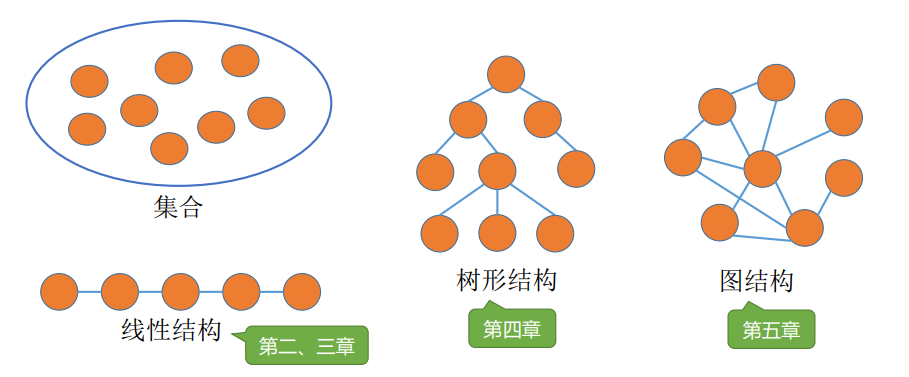

# 数据结构

## 基本概念

### 什么是数据

数据是**信息的载体**，是描述客观事物属性的数、字符及所有**能输入到计算机中并被计算机程序识别**和处理的符号的集合，数据是计算机程序加工的原料。

### 数据元素、数据项

**数据元素**是数据的基本单位，通常作为一个整体进行考虑和处理。

一个数据元素可以由若干**数据项**组成，数据项是构成数据元素的不可分割的最小单位。

### 数据结构、数据对象

**数据结构**是相互之间存在一种或多种特定**关系**的数据元素的集合。

**数据对象**是具有**相同性质**的数据元素的集合，是数据的一个子集。

### 数据类型、抽象数据类型

**数据类型**是一个值的集合和定义在此集合上的一组操作的总称：

- 原子类型：其值不可再分的数据类型
- 结构类型：其值可以再分解为若干成分（分量）的数据类型。

**抽象数据类型（Abstract Data Type, ADT）**是抽象数据组织及与之相关的操作。

### 什么是数据结构（浙大）

**数据对象**在计算机中的组织方式：

- 逻辑结构
- 物理存储结构

数据对象必定与一系列加在其上的**操作**相关联。

完成这些操作所用的方法就是**算法**。

### 抽象数据类型（浙大）

数据类型：

- 数据对象集
- 数据集合相关联的操作集

抽象：描述数据类型的方法不依赖于具体实现

- 与存放数据的机器无关
- 与数据存储的物理结构无关
- 与实现操作的算法和编程语言均无关

只描述数据对象集合相关操作集**是什么**，并不涉及**如何做到**的问题。

## 三要素

### 数据的逻辑结构

**集合：** 各个元素同属一个集合，别无其他关系。

**线性结构：** 数据元素是一对一的关系，除了第一个元素，所有元素都有唯一前驱；除了最后一个元素，所有元素都有唯一后继。

**树形结构：** 数据元素之间是一对多的关系。

**图结构：** 数据元素之间是多对多的关系。

### 数据的物理结构（存储结构）

**顺序存储：** 把**逻辑上相邻的元素存储在物理位置上也相邻的存储单元中**，元素之间的关系由存储单元的邻接关系来体现。

**链式存储：** **逻辑上相邻的元素在物理位置上可以不相邻**，借助指示元素存储地址的指针来表示元素之间的逻辑关系。

**索引结构：** 在存储元素信息的同时，还建立附加的索引表。索引表中的每项称为索引项，索引项的一般形式是（关键字，地址）。

**散列结构：** 根据元素的关键字直接计算出该元素的存储地址，又称**哈希（Hash）存储**。

理解：

- 若采用**顺序存储**，则各个数据元素在物理上必须是**连续的**；若采用**非顺序存储**，则各个数据在物理上可以试**离散的**。
- 数据的**存储结构**会**影响存储空间分配的方便程度**。
- 数据的**存储结构**会**影响对数据运算的速度**。

### 数据的运算

**运算的定义**是针对**逻辑结构**的，指出运算的功能；**运算的实现**是针对**存储结构**的，指出运算的具体操作步骤。

