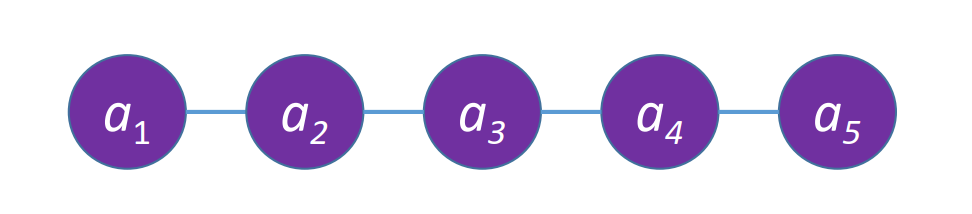

# 线性表

## 线性表的定义


线性表是具有**相同**数据类型的 $n(n \ge 0)$ 个**数据元素**的**有限序列**，其中 $n$ 为**表长**，当 $n = 0$ 时线性表是一个**空表**。若用 $L$ 命名线性表，则其一般表示为：
$$
L = (a_1, a_2, \cdots, a_i, a_{i + 1}, \cdots, a_n)
$$
几个概念：

- $a_i$ 是线性表中的“第 $i$ 个”元素线性表中的**位序**，位序从 $1$ 开始，数组下标从 $0$ 开始。
- $a_1$ 是**表头元素**，$a_n$ 是**表尾元素**。

除第一个元素外，每个元素有且仅有一个**直接前驱**；除最后一个元素外，每个元素有且仅有一个**直接后继**。



## 线性表的基本操作

`InitList(& ls)`：**初始化**表，构造一个空的线性表`ls`，分配内存空间。

`DestroyList(& ls)`：**销毁**线性表，并释放线性表`ls`所占用的内存空间。

`ListInsert(& ls, i, e)`：**插入**操作，在表`ls`中的第`i`个位置上插入指定元素`e`。

`ListDelete(& ls, i, & e)`：**删除**操作，删除表`ls`中第`i` 个位置的元素，并用`e`返回删除元素的值。

`LocateElem(ls, e)`：**按值查找**操作，在表`ls`中查找具有给定关键字值的元素。

`GetElem(ls, i)`：**按位查找**操作，获取表`ls`中第`i`个位置的元素的值。

# 顺序表


## 顺序表的定义

**顺序表：** 用**顺序存储**的方式实现线性表。

**顺序存储：** 把**逻辑上相邻**的元素存储在**物理位置上也相邻**的存储单元中，元素之间的关系由存储单元的邻接关系来体现。

```cpp
typedef struct {
	ElemType num;  // 号数
	ElemType people;  // 人数
} Customer;
```

其中`ElemType`是数据元素的数据类型，我们可以用`sizeof(ElemType)`来返回某数据类型的大小：

```cpp
int x = 10;

sizeof(int) = 4
sizeof(x) = 4
sizeof(Customer) = 8
```

## 顺序表的实现

顺序表的特点：

- 随机访问，可以在 $O(1)$ 时间内找到第 $i$ 个元素。
- 存储密度高，每个节点只存储数据元素。
- 扩展容量不方便（即使使用动态分配，时间复杂度也较高）。
- 插入、删除等操作不方便，需要移动大量元素。

### 静态分配

定义顺序表类型：

```cpp
#define MaxSize 10  // 定义最大长度
typedef struct {
	ElemType data[MaxSize];  // 用静态数组来存放数据
	int length;  // 顺序表当前的长度
} SqList;  // 顺序表的类型定义
```

基本操作——初始化顺序表：

```cpp
#include "bits/stdc++.h"

using namespace std;

#define MaxSize 10  // 定义最大长度
typedef struct {
    int data[MaxSize];  // 用静态数组存放数据元素
    int length;  // 顺序表的当前长度
} SqList;  // 顺序表的类型定义


// 基本操作：初始化顺序表
void InitList(SqList &ls) {
    for (int i = 0; i < MaxSize; i ++) {
        ls.data[i] = 0;  // 将所有数据元素设置为默认初始值
    }

    ls.length = 0;  // 顺序表初始长度为 0
}

int main() {
    SqList ls;  // 声明一个顺序表
    InitList(ls);  // 初始化顺序表

	// ...
    return 0;
}
```

### 动态分配

定义顺序表类型：

```cpp
#define InitSize 10  // 顺序表的初始长度
typedef struct {
    ElemType *data;  // 指示动态分配数组的指针
    int MaxSize;  // 顺序表的最大容量
    int length;  // 顺序表的当前长度
} SqList;  // 顺序表的定义（动态分配方式）
```

基本操作——初始化顺序表：

```cpp
#include "bits/stdc++.h"

using namespace std;

#define InitSize 10
typedef struct {
    int *data;  // 指示动态分配数组的指针
    int MaxSize;  // 顺序表的最大容量
    int length;  // 顺序表的当前长度
} SqList;

void InitList(SqList &ls) {
    ls.data = new int[InitSize];  // 动态分配存储空间
    ls.length = 0;  // 初始长度为 0
    ls.MaxSize = InitSize;  // 初始最大容量
}

void IncreaseSize(SqList &ls, int len) {
    int *newList = new int[ls.MaxSize + len];  // 新建一个数组

    // 将顺序表中元素存进新数据
    memcpy(newList, ls.data, ls.length * sizeof(int));
    delete [] ls.data;  // 释放原数组

    ls.data = newList;  // 更新顺序表数组
    ls.MaxSize += len;  // 更新顺序表容量
}

int main() {
    SqList ls;
    InitList(ls);

    cout << "扩容前的容量：" << ls.MaxSize << endl;

    IncreaseSize(ls, 10);  // 扩容

    cout << "扩容后的容量：" << ls.MaxSize << endl;

    return 0;
}
```

## 顺序表的插入和删除


### 顺序表的插入

静态顺序表：

```cpp
// 基本操作：插入元素
void ListInsert(SqList &ls, int i, int e) {
    if (ls.length == MaxSize) {
        cout << "表已满！" << endl;
    }
    else if (i <= ls.length) {
        // 将第 i 个元素及之后所有元素后移一位
        for (int j = ls.length; j >= i; j --) {
            ls.data[j] = ls.data[j - 1];
        }

        ls.data[i - 1] = e;  // 插入元素 e
    }
    else {  // 如果长度小于插入坐标，则直接在最后插入
        ls.data[ls.length] = e;
    }

    ls.length ++;  // 更新长度
}
```

动态顺序表：区别在于动态分配实现的顺序表可以自动扩容

```cpp
// 基本操作：插入元素
void ListInsert(SqList &ls, int i, int e) {
    if (ls.length == ls.MaxSize) {
        IncreaseSize(ls, 10);  // 扩容
    }
    
    if (i <= ls.length) {
        // 将第 i 个元素及之后所有元素后移一位
        for (int j = ls.length; j >= i; j --) {
            ls.data[j] = ls.data[j - 1];
        }

        ls.data[i - 1] = e;  // 插入元素 e
    }
    else {  // 如果长度小于插入坐标，则直接在最后插入
        ls.data[ls.length] = e;
    }

    ls.length ++;
}
```

### 顺序表的删除

静态顺序表：

```cpp
// 基本操作：删除元素
void ListDelete(SqList &ls, int i, int &e) {
    if (i >= ls.length) {
        cout << "错误！超出顺序表长度！" << endl;
        return ;
    }

    e = ls.data[i - 1];  // 记录被删除元素的值
    // 删除元素后面的元素往前移动
    for (int j = i; j < ls.length; j ++) {
        ls.data[j - 1] = ls.data[j];
    }

    ls.length --;  // 长度减 1
}
```

动态顺序表：

```cpp
// 基本操作：删除元素
void ListDelete(SqList &ls, int i, int &e) {
    if (i >= ls.length) {
        cout << "错误！超出顺序表长度！" << endl;
        return ;
    }

    e = ls.data[i - 1];  // 记录被删除元素的值
    // 删除元素后面的元素往前移动
    for (int j = i; j < ls.length; j ++) {
        ls.data[j - 1] = ls.data[j];
    }

    ls.length --;  // 长度减 1
}
```

测试代码（通用）：

```cpp
int main() {
    SqList ls;
    InitList(ls);

    for (int i = 1; i <= 8; i ++) ListInsert(ls, 1, i);

    for (int i = 0; i < ls.length; i ++) cout << ls.data[i] << endl;

    
    int e;
    ListDelete(ls, 3, e);
    cout << "被删元素：" << e << endl;
    for (int i = 0; i < ls.length; i ++) cout << ls.data[i] << endl;

    return 0;
}
```

输出结果：

```shell
8
7
6
5
4
3
2
1
被删元素：6
8
7
5
4
3
2
1
```

## 顺序表的查找


### 顺序表的按位查找

```cpp
// 基本操作：按位查找
int GetElem(SqList ls, int i) {
    return ls.data[i - 1];
}
```

### 顺序表的按值查找

```cpp
// 基本操作：按值查找
int LocateElem(SqList ls, int e) {
    for (int i = 0, l = ls.length; i < l; i ++) {
        if (ls.data[i] == e) return i + 1;
    }

    return -1;  // 元素不存在，返回 -1
}
```

# 单链表

## 单链表的定义


用代码定义单链表：

- `ListNode`：代表链表结点，强调这是一个结点
- `ListLink`：代表链表结点的指针，强调这是一个单链表

定义新链表时，两种方法均可：`ListNode *ls`，`ListLink ls`

```cpp
// ListNode: 链表结点，强调结点
// ListLink: 链表结点中的指针，强调单链表
// 声明链表时，两种方法均可：ListNode *ls, ListLink ls
typedef struct ListNode {  // 定义单链表结点类型
    int val;  // 每个节点存放的数据
    ListNode *next;  // 指针指向下一个节点
} ListNode, *ListLink;
```

## 单链表的初始化

### 带头结点

在带头结点的链表中，头结点始终位于链表的最前面，它的值不重要，我们只关心头结点之后的结点的值。

```cpp
// 初始化链表
// ls 为链表头结点，它的值无所谓，只关心它的下一个节点
ListLink InitListNode() {
    ListLink ls = new ListNode;
    ls->next = NULL;

    return ls;
}
```

### 不带头结点

```cpp
// 初始化链表
// 没有头结点，ls 为第一个结点，初始为 NULL
ListLink InitListNode() {
    ListLink ls = NULL;

    return ls;
}
```

## 判断单链表是否为空

### 带头结点

我们为链表定义了头结点，所以头结点的下一个节点就是链表的第一个结点，判断链表是否为空只需判断第一个结点是否存在：

```cpp
// 判断链表是否为空
bool IsEmpty(ListLink ls) {
    return ls->next == NULL;
}
```

### 不带头结点

```cpp
// 判断链表是否为空
bool IsEmpty(ListLink ls) {
    return ls == NULL;
}
```

## 单链表的插入和删除

### 按位序插入

#### 带头结点

按位序插入，`ListNodeInsert(ListLink ls, int i, int e)`：将元素 `e` 插入到 `ls` 中位序为 `i` 的位置。

```cpp
// 按位序插入到指定位置
void ListNodeInsert(ListLink &ls, int i, int e) {
    if (i < 1) {cout << "i < 1" << endl; return ;}  // 必须大于等于位序 1

    ListLink node = ls;  // 创建一个结点来搜索
    int idx = 0;  // 初始化搜索下标

    // 直到 idx = i - 1 或结点不存在才停止
    while (node != NULL and idx < i - 1) {
        node = node->next;
        idx ++;
    }

    // 特判一下 node 是否已经不存在（i大于链表长度）
    if (node == NULL) {cout << "i > ls.length" << endl; return ;}

    // 插入结点
    ListLink p = new ListNode;
    p->val = e;
    p->next = node->next;
    node->next = p;
}
```

#### 不带头结点

不带头结点的插入需要注意：第一个元素的修改需要更改头指针

```cpp
// 按位序插入
void ListNodeInsert(ListLink &ls, int i, int e) {
    if (i < 1) {cout << "i < 1" << endl; return ;}

    if (i == 1) {
        ListLink p = new ListNode;
        p->val = e;
        p->next = ls;
        ls = p;
    }
    else {
        ListLink node = ls;
        int idx = 1;

        while (node != NULL and idx < i - 1) {
            node = node->next;
            idx ++;
        }

        if (node == NULL) {cout << "i > ls.length" << endl; return ;}

        ListLink s = new ListNode;
        s->val = e;
        s->next = node->next;
        node->next = s;
    }
}
```

### 指定结点的后插操作

```cpp
// 指定结点的后插操作
void ListNodeInsert2Next(ListLink node, int e) {
    if (node == NULL) {cout << "ls == NULL" << endl; return ;}

    // 新建结点，插入到 node 结点后面
    ListLink p = new ListNode;
    p->val = e;
    p->next = node->next;
    node->next = p;
}
```

### 	指定结点的前插操作

```cpp
// 指定结点的前插操作
void ListNodeInsert2Prior(ListLink node, int e) {
    if (node == NULL) {cout << "ls == NULL" << endl; return ;}

    ListLink p = new ListNode;
    // 先将 p 插到 node 后面
    // 然后把 node.val 给 p.val
    // 最后再 node.vel = e
    p->next = node->next;
    node->next = p;
    p->val = node->val;
    node->val = e;
}
```

### 按位序删除

```cpp
// 按位序删除，并返回删除的结点的值
void ListNodeDelete(ListLink &ls, int i, int &e) {
    if (i < 1) {cout << "i < 1" << endl; return ;}

    // node 为被删除结点的前一个结点
    ListLink node = ls;
    int idx = 0;
    while (node != NULL and idx < i - 1) {
        node = node->next;
        idx ++;
    }

    if (node == NULL or node->next == NULL) {
        cout << "结点不存在" << endl;
        return ;
    }

    // p 为被删除的结点
    ListLink p = node->next;
    node->next = p->next;

    // 返回被删除节点值，并释放空间
    e = p->val;
    delete p;
}
```

### 指定结点的删除

```cpp
// 指定结点的删除
void ListNodeDeleteNode(ListLink node) {
    if (node == NULL) {cout << "node = NULL" << endl; return ;}
    if (node->next == NULL) {cout << "node 是最后一个结点，需要从前往后遍历删除" << endl; return ;}

    // 将 node.next 的值给 node
    // 然后将 node.next 删除
    node->val = node->next->val;
    node->next = node->next->next;
}
```

## 单链表的查找

### 按位查找

需要注意的是，按位查找可以返回头结点，`i` 可以为 `0`。

```cpp
// 按位查找元素，返回第 i 个结点
// 和插入与删除不同，可以返回头结点，所以 i 的判定为 0
ListLink GetNode(ListLink ls, int i) {
    if (i < 0) {cout << "i < 0" << endl; return NULL;}

    ListLink node = ls;
    int idx = 0;
    while (node != NULL and idx < i) {
        node = node->next;
        idx ++;
    }

    return node;
}
```

### 按值查找

```cpp
// 在链表中查找元素，并返回该元素的结点
ListLink LocateNode(ListLink ls, int e) {
    ListLink node = ls->next;

    while (node != NULL and node->val != e) node = node->next; 

    return node;
}
```

### 求单链表的长度

```cpp
// 返回单链表的长度
int ListNodeLength(ListLink ls) {
    int len = 0;
    ListLink node = ls->next;
    while (node != NULL) {
        node = node->next;
        len ++;
    }

    return len;
}
```

# 循环链表

表尾结点的`next`指针指向头结点的单链表。

## 循环单链表

### 初始化

```cpp
// 初始化循环链表
// 最后一个结点的 next 指向头结点
ListLink InitListNode() {
    ListLink ls = new ListNode;
    ls->next = ls;

    return ls;
}
```

### 判断是否为空

```cpp
// 判断循环单链表是否为空
bool IsEmpty(ListLink ls) {
    return ls->next == ls;
}
```

### 判断节点`node` 是否为尾节点

```cpp
// 判断结点 node 是否为尾结点
bool IsTail(ListLink ls, ListLink node) {
    return node->next == ls;
}
```

## 循环双链表


