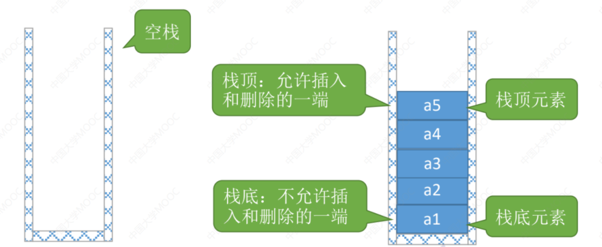

# 栈（Stack）

## 栈的定义

**线性表**是具有相同数据类型的 $n(n \ge 0)$ 个数据元素的有限序列，其中 $n$ 为表长，当 $n = 0$ 时线性表是一个空表。若用`ls`明明线性表，则其一般表示为：
$$
\text{ls} = (a_1, a_2, \cdots, a_i, a_{i + 1}, \cdots, a_n)
$$
**栈（Stack）**是只允许在一端进行插入或删除操作的线性表。



**特点：** 后进先出（Last In First Out, LIFO）

## 栈的基本操作

`InitStack(&Stk)`：**初始化**栈，构造一个空栈`Stk`，分配内存空间。

`DestroyStack(&Stk)`：**销毁**栈，销毁并释放栈`Stk`所占用的内存空间。

`Push(&Stk, x)`：**进栈**，若栈`Stk`未满，则将`x`加入使之成为新**栈顶**。

`Pop(&Stk, &x)`：**出栈**，若栈`Stk`非空，则弹出**栈顶**元素，并用`x`返回。

`GetTop(Stk, &x)`：返回**栈顶**元素，若栈`Stk`非空，则返回栈顶元素。

`IsEmpty(Stk)`：返回一个栈是否为空栈。

## 常考题型

$n$ 个不同元素进栈，出栈元素不同排列个数为：$\frac{1}{n + 1} C_{2n}^{n}$，称为卡特兰数。

如：$5$ 个元素时，有 $\frac{1}{5 + 1} C_{10}^{5} = 42$ 中情况。

# 顺序栈

## 顺序栈的定义

```cpp
#define MaxSize 10
typedef struct {
    int data[MaxSize];  // 使用静态数组存放栈中元素
    int top;  // 栈顶指针
} SqStack;
```

## 顺序栈的初始化

```cpp
// 初始化栈
SqStack InitStack() {
    SqStack Stk;
    Stk.top = -1;  // 初始化栈顶指针

    return Stk;
}

int main() {
    SqStack Stk = InitStack();  // 声明一个栈

    return 0;
}
```

## 进栈操作

```cpp
// 新元素进栈
void Push(SqStack &Stk, int x) {
    if (Stk.top == MaxSize - 1) {
        cout << "栈满" << endl;
        return ;
    }

    // 更新栈顶指针，插入元素
    Stk.top ++;
    Stk.data[Stk.top] = x;
}
```

## 出栈操作

```cpp
// 栈顶出栈
void Pop(SqStack &Stk, int &x) {
    if (Stk.top == -1) {
        cout << "空栈" << endl;
        return ;
    }

    // 返回栈顶值，并更新栈顶
    // 并不是真的将元素删除，而是更新栈顶指针
    x = Stk.data[Stk.top];
    Stk.top --;
}
```

## 返回栈顶

```cpp
// 返回栈顶元素
void GetTop(SqStack Stk, int &x) {
    if (Stk.top == -1) {
        cout << "空栈" << endl;
        return ;
    }

    x =  Stk.data[Stk.top];
}
```

# 链栈

## 链栈的定义


