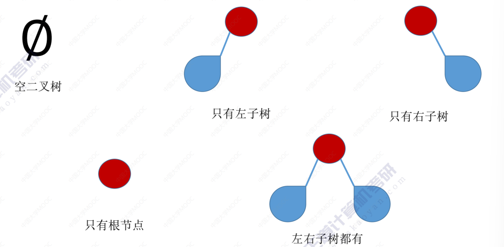
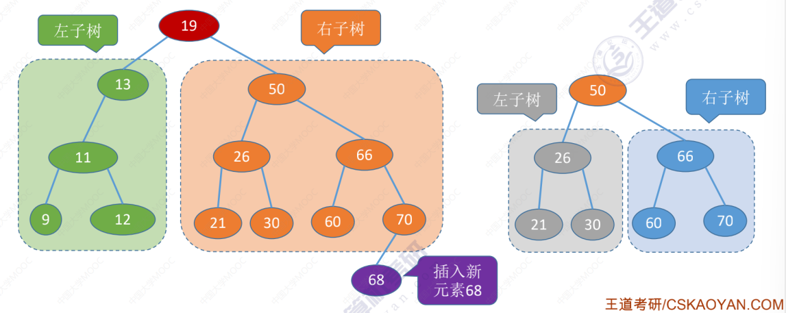
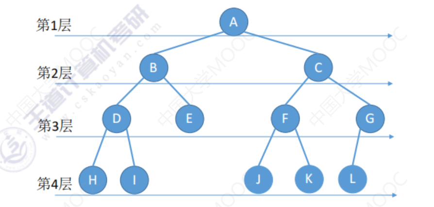

# 树-定义与基本术语

## 树的基本概念

**空树：** $\emptyset$ 结点数为 $0$ 的树。

**非空树：** 

- 有且仅有一个根节点。
- 没有后继的结点称为“叶子结点”（或终端结点）。
- 有后继的结点称为“分支结点”（或非终端结点）。
- 除了根节点外，任何一个结点都**有且仅有一个前驱**。
- 每个结点可以有 $0$ 个或多个后继。

树是 $n(n \ge 0)$ 个**结点**的有限集合，$n = 0$ 时，称为**空树**，这是一种特殊情况。在任意一颗**非空树**中应满足：

- 有且仅有一个特定的称为**根**的结点。
- 当 $n > 1$ 时，其余结点可分为 $m (m > 0)$ 个**互不相交的有限集合** $T_1, T_2, \cdots , T_m$，其中每个集合本身又是一棵树，并且称为根结点的**子树**。


## 树的基本术语

### 结点之间的关系描述

- 什么是**祖先结点**？
- 什么是**子孙结点**？
- 什么是**双亲结点（父结点）**？
- 什么是**孩子结点**？
- 什么是**兄弟结点**？
- 什么是**堂兄弟结点**？
- 什么是两个结点之间的**路径**？（只能从上往下）
- 什么是**路径长度**？（经过几条边）


### 结点、树的属性描述

- 结点的层次（深度，默认从 $1$ 开始）：从上往下数
- 结点的高度：从下网上数
- 树的高度（深度）：总共多少层
- **结点的度**：有几个孩子（分支）
- **树的度**：各结点的度的最大值


### 有序树 VS 无序树

有序树：逻辑上看，树中结点的各子树从左至右是**有次序的**，不能互换。

无序树：逻辑上看，树中结点的各子树从左至右是**无次序的**，可以互换。

### 树 VS 森林

**森林：** 森林是 $m (m \ge 0)$ 棵互不相交的树的集合。

# 树-常考性质

## 性质：结点树与总度数的关系

结点数 $=$ 总度数 $+ 1$

## 性质：树的度与`N`叉树的区别

| 度为 $m$ 的树                            | $m$ 叉树                                 |
| ---------------------------------------- | ---------------------------------------- |
| 任意结点的度 $\le m$ （最多 $m$ 个孩子） | 任意结点的度 $\le m$ （最多 $m$ 个孩子） |
| 至少有一个结点度 $= m$ （有 $m$ 个孩子） | 允许所有结点的度都 $< m$                 |
| 一定是非空树，至少有 $m + 1$ 个结点      | 可以是空树                               |

## 性质：结点数与层数的关系

度为 $m$ 的树第 $i$ 层至多有 $m^{i - 1}$ 个结点 $i \ge 1$，$m$ 叉树第 $i$ 层至多有 $m^{i - 1}$ 个结点 $i \ge 1$

## 性质：结点数与高度的关系

高度为 $h$ 的 $m$ 叉树至多有 $\frac{m^h - 1}{m - 1}$ 个结点。

等比数列求和公式：$a + aq + aq^2 + \cdots + aq^{n - 1} = \frac{a (1 - q^n)}{1 - q}$

高度为 $h$ 的 $m$ 叉树至少有 $h$ 个结点。

高度为 $h$、度为 $m$ 的树至少有 $h + m - 1$ 个结点。

具有 $n$ 个结点的 $m$ 叉树的最小高度为 $\left \lceil \log_m (n(m - 1) + 1) \right \rceil$

# 二叉树-定义与基本术语

## 二叉树的基本概念

**二叉树**是 $n (n \ge 0)$ 个结点的有限集合：

- 或者为**空二叉树**，即 $n = 0$
- 或者由一个**根结点**和两个互不相交的被称为根的**左子树**和**右子树**组成。左子树和右子树又分别是一颗二叉树。

特点：

- 每个结点至多只有两棵子树
- 左右子树不能颠倒（二叉树是有序树）

## 二叉树的五种状态



## 几个特殊的二叉树

### 满二叉树

**满二叉树（完美二叉树）：**所有叶结点的深度均相同的二叉树，只有最后一层有叶子结点，不存在度为 $1$ 的结点。


### 完全二叉树

**完全二叉树：**只有最下面两层结点度数可以小于 2，且最下面一层的结点都集中在该层最左边的连续位置上。


### 二叉排序树

**二叉排序树：** 一棵二叉树或者是空二叉树，或者是具有如下性质的二叉树：

- 左子树上所有结点的关键字均小于根结点的关键字。
- 右子树上所有结点的关键字均大于根节点的关键字。
- 左右子树各是一颗二叉排序树。



### 平衡二叉树

**平衡二叉树：** 树上任一结点的左子树和右子树的深度之差不超过 $1$。

# 二叉树-常考性质

## 性质1

设非空二叉树中度为 $0, 1, 2$ 的结点的个数分别为 $n_0, n_1, n_2$，则 $n_0 = n_2 + 1$

设树中结点总数为 $n$，则：

- $n = n_0 + n_1 + n_2$
- $n = n_1 + 2n_2 + 1$

## 性质2

二叉树第 $i$ 层至多有 $2^{i - 1}$ 个结点 $i \ge 1$

$m$ 叉树第 $i$ 层 至多有 $m ^{i - 1}$ 个结点 $i \ge 1$

## 性质3

高度为 $h$ 的二叉树至多有 $2^h - 1$ 个结点（满二叉树）。

具有 $n$ 个结点的完全二叉树的高度 $h$ 为 $\left \lceil \log_2 (n + 1) \right \rceil$ 或 $\left \lceil \log_2 n \right \rceil + 1$

## 性质4

对于完全二叉树，可以由总的结点数 $n$ 推出度为 $0, 1, 2$ 的结点个数 $n_0, n_1, n_2$

完全二叉树最多只有一个度为 $1$ 的结点，即 $n_1 = 0$ 或 $n_1 = 1$

所以：

- 若完全二叉树有 $2k$ 个结点，则 $n_1 = 1, n_0 = k, n_2 = k - 1$
- 若完全二叉树有 $2k - 1$ 个结点，则 $n_1 = 0, n_0 = k, n_2 = k - 1$

# 二叉树-存储结构

## 二叉树的顺序存储

总结：二叉树的顺序存储结构，只适合存储完全二叉树。

## 二叉树的链式存储

```cpp
// 二叉树的结点（链式存储）
typedef struct BiTNode {
    int val;  // 数据域
    BiTNode *l, *r;  // 左孩子和右孩子
} BiTNode, *BiTree;

// 初始化二叉树
BiTree InitBiTree(int val) {
    BiTree root = new BiTNode;
    root->l = NULL; root->r = NULL;
    root->val = val;

    return root;
}
```

# 二叉树-先/中/后序遍历

## 什么是遍历

遍历：按照某种次序把所有结点都访问一遍。

## 二叉树的遍历

二叉树的递归特性：

- 要么是空二叉树
- 要么就是由根节点+左子树+右子树组成的二叉树

### **先序遍历：** 根左右（NLR）

```cpp
// 先序遍历
void PreOrder(BiTree root) {
    if (root != NULL) {
        cout << root->val << " ";  // 访问根结点
        PreOrder(root->l);  // 递归遍历左子树
        PreOrder(root->r);  // 递归遍历右子树
    }
}
```

## **中序遍历：** 左根右（LNR）

```cpp
// 中序遍历
void InOrder(BiTree root) {
    if (root != NULL) {
        PreOrder(root->l);  // 递归遍历左子树
        cout << root->val << " ";  // 访问根结点
        PreOrder(root->r);  // 递归遍历右子树
    }
}
```

## **后序遍历：** 左右根（LRN）

```cpp
// 后序遍历
void PostOrder(BiTree root) {
    if (root != NULL) {
        PreOrder(root->l);  // 递归遍历左子树
        PreOrder(root->r);  // 递归遍历右子树
        cout << root->val << " ";  // 访问根结点
    }
}
```

## 返回树的深度

```cpp
// 返回树的深度
int TreeDepth(BiTree root) {
    if (root == NULL) return 0;

    int l = TreeDepth(root->l);
    int r = TreeDepth(root->r);

    return l > r ? l + 1 : r + 1;
}
```

# 二叉树-层序遍历

算法思想：

- 初始化一个辅助队列，根结点入队
- 若队列非空，则队头结点出队，访问该结点，并将其左右孩子插入队尾（如果存在）
- 重复上述操作直到队列为空



```cpp
// 层序遍历
void LevelOrder(BiTree root, vector<int> &ls) {
    if (!root) return ;

    queue<BiTree> que;
    que.push(root);  // 根结点入队

    while (!que.empty()) {
        BiTree p = que.front();
        que.pop();  // 队头出队

        ls.push_back(p->val);  // 记录出队结点的值
        
        if (p->l) que.push(p->l);  // 左儿子入队
        if (p->r) que.push(p->r);  // 右儿子入队
    }
}
```

如果要分别记录每层的元素，则只需增加一个循环即可：

```cpp
// 层序遍历，按层记录
void LevelOrderByLevel(BiTree root, vector<vector<int>> &ls) {
    if (!root) return ;

    queue<BiTree> que;
    que.push(root);

    while (!que.empty()) {
        int que_size = que.size();
        vector<int> temp;

        while (que_size -- ) {
            auto node = que.front(); que.pop();

            temp.push_back(node->val);
            if (node->l) que.push(node->l);
            if (node->r) que.push(node->r);
        }

        ls.push_back(temp);
    }
}
```

# 由遍历序列构造二叉树

若只给出一棵二叉树的 前/中/后/层 序遍历序列中的一种，不能唯一确定一棵二叉树。

# 线索二叉树

