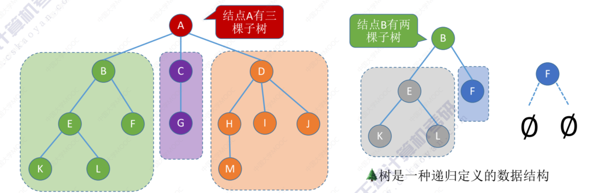
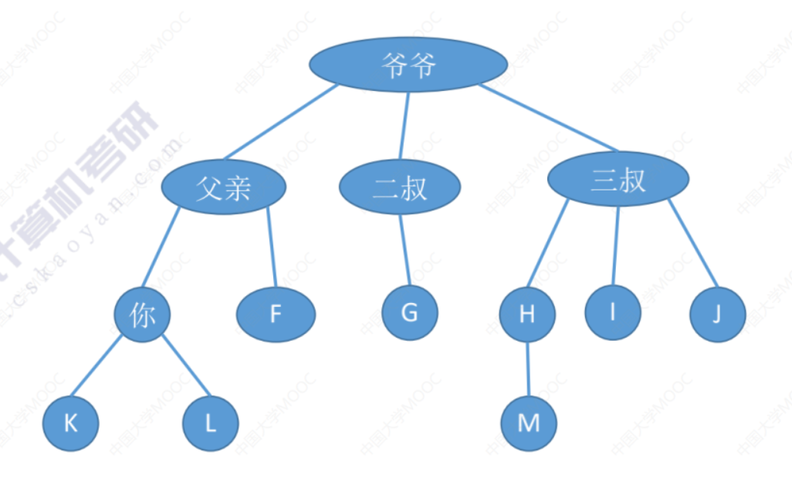
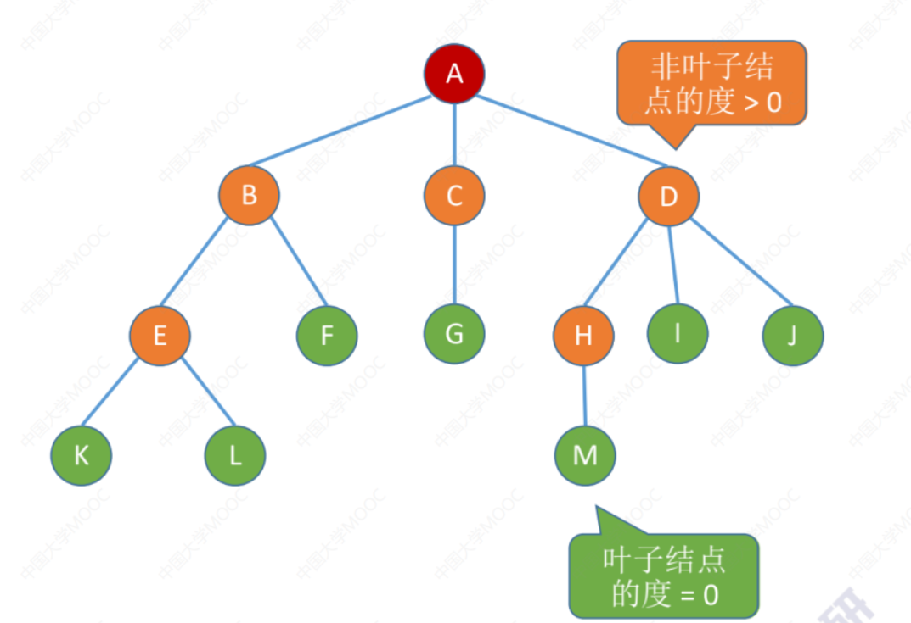

# 树-定义与基本术语

## 树的基本概念

**空树：** $\emptyset$ 结点数为 $0$ 的树。

**非空树：** 

- 有且仅有一个根节点。
- 没有后继的结点称为“叶子结点”（或终端结点）。
- 有后继的结点称为“分支结点”（或非终端结点）。
- 除了根节点外，任何一个结点都**有且仅有一个前驱**。
- 每个结点可以有 $0$ 个或多个后继。

树是 $n(n \ge 0)$ 个**结点**的有限集合，$n = 0$ 时，称为**空树**，这是一种特殊情况。在任意一颗**非空树**中应满足：

- 有且仅有一个特定的称为**根**的结点。
- 当 $n > 1$ 时，其余结点可分为 $m (m > 0)$ 个**互不相交的有限集合** $T_1, T_2, \cdots , T_m$，其中每个集合本身又是一棵树，并且称为根结点的**子树**。

## 树的基本术语

### 结点之间的关系描述

- 什么是**祖先结点**？
- 什么是**子孙结点**？
- 什么是**双亲结点（父结点）**？
- 什么是**孩子结点**？
- 什么是**兄弟结点**？
- 什么是**堂兄弟结点**？
- 什么是两个结点之间的**路径**？（只能从上往下）
- 什么是**路径长度**？（经过几条边）

### 结点、树的属性描述

- 结点的层次（深度，默认从 $1$ 开始）：从上往下数
- 结点的高度：从下网上数
- 树的高度（深度）：总共多少层
- **结点的度**：有几个孩子（分支）
- **树的度**：各结点的度的最大值

### 有序树 VS 无序树

有序树：逻辑上看，树中结点的各子树从左至右是**有次序的**，不能互换。

无序树：逻辑上看，树中结点的各子树从左至右是**无次序的**，可以互换。

### 树 VS 森林

**森林：** 森林是 $m (m \ge 0)$ 棵互不相交的树的集合。

# 树-常考性质

## 性质：结点树与总度数的关系

结点数 $=$ 总度数 $+ 1$

## 性质：树的度与`N`叉树的区别

| 度为 $m$ 的树                            | $m$ 叉树                                 |
| ---------------------------------------- | ---------------------------------------- |
| 任意结点的度 $\le m$ （最多 $m$ 个孩子） | 任意结点的度 $\le m$ （最多 $m$ 个孩子） |
| 至少有一个结点度 $= m$ （有 $m$ 个孩子） | 允许所有结点的度都 $< m$                 |
| 一定是非空树，至少有 $m + 1$ 个结点      | 可以是空树                               |

