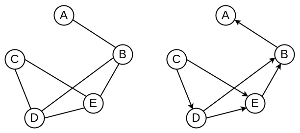
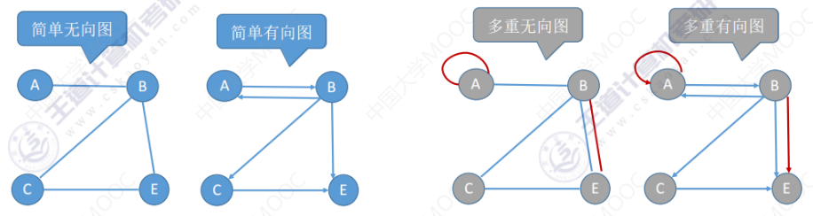
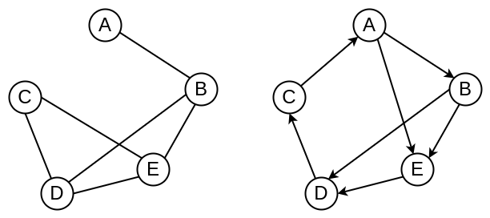
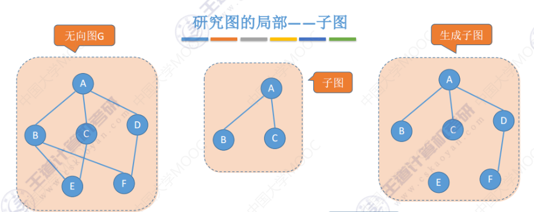
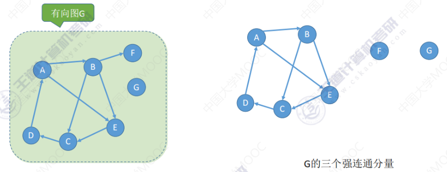
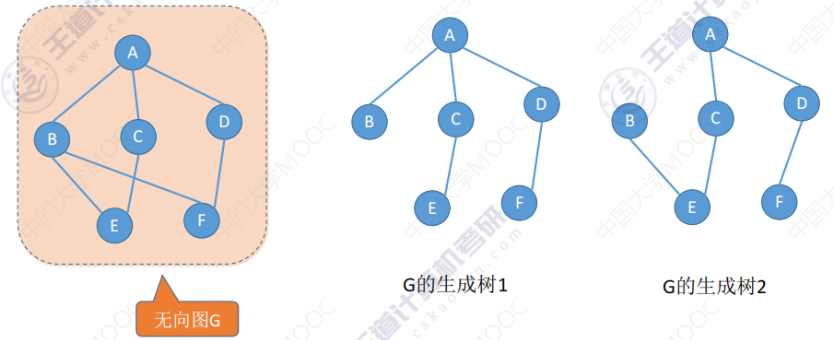
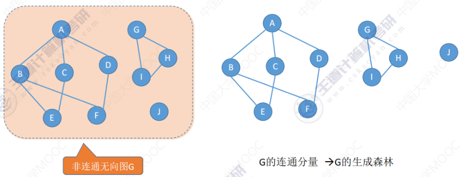

# 图的定义与基本术语

## 图的定义

图 $G$ 由**顶点集** $V$ 和**边集** $E$ 组成，记为 $G = (V, E)$，其中 $V(G)$ 表示图 $G$ 中顶点的有限个非空集；$E(G)$ 表示图 $G$ 中顶点之间的关系（边）集合。若 $V = \{v_1, v_2, \cdots, v_n\}$，则用 $|V|$ 表示图 $G$ 中**顶点的个数**，也称图 $G$ 的**阶**，$E = \{(u, v) | u \in V, v \in V\}$，用 $|E|$ 表示图 $G$ 中**边的条数**。

注意：线性表可以是空表，树可以是空树，但图不可以为空，即 $V$ 一定是**非空集**。

## 无向图与有向图

若 $E$ 是**无向边**（简称**边**）的有限集合时，则图 $G$ 为**无向图**。边是顶点的无序对，记为 $(v, w)$ 或 $(w, v)$，因为 $(v, w) = (w, v)$，其中 $v, w$ 为顶点。可以说顶点 $w$ 和顶点 $v$ 互为邻接点，边 $(v, w)$ 依附于顶点 $v$ 和 $w$，或者说边 $(v, w)$ 和顶点 $v, w$ 相关联。

如下左图为无向图，则可表示为：

`V = {A, B, C, D, E}`

`E = {(A, B), (B, D), (B, E), (C, D), (C, E), (D, E)}`

若 $E$ 是**有向边**（也称**弧**）的有限集合时，则图 $G$ 为**有向图**。弧是顶点的有序对，记为 $<v, w>$，其中 $v, w$ 是顶点，$v$ 称为**弧尾**，$w$ 称为**弧头**，$<v, w>$ 称为从顶点 $v$ 到顶点 $w$ 的弧，也称 $v$ 邻接到 $w$，或 $w$ 邻接自 $v$。$<v, w> \ne <w, v>$

如下右图为有向图，则可表示为：

`V = {A, B, C, D, E}`

`E = {<B, A>, <E, B>, <D, B>, <D, E>, <C, D>, <C, E>}`

## 简单图与多重图

**简单图**：不存在重复边；不存在顶点到自身的边。

**多重图**：图 $G$ 中某两个结点之间的边数多于一条，又允许顶点通过同一条边和自己关联，则 $G$ 为多重图。

## 顶点的度和出入度

对于**无向图**：顶点 $v$ 的度是指依附于该顶点的边的条数，记为 $TD(v)$。

在具有 $n$ 个顶点、$e$ 条边的无向图中，$\displaystyle \sum_{i = 1}^{n} TD(v_i) = 2e$，即无向图的全部顶点的度的和等于边数的两倍。

对于**有向图**：**入度**是以顶点 $v$ 为终点的有向边的数目，记为 $ID(v)$；**出度**是以顶点 $v$ 为起点的有向边的数目，记为 $OD(v)$。顶点 $v$ 的**度**等于其入读和出度之和，即 $TD(v) = ID(v) + OD(v)$。

在具有 $n$ 个顶点、$e$ 条边的有向图中，$\displaystyle \sum_{i = 1}^{n} ID(v_i) = \sum_{i = 1}^{n} OD(v_i) = e$。

## 顶点与顶点的关系描述

**路径：**顶点 $v_p$ 到顶点 $v_q$ 之间的一条路径是指顶点序列 $v_p, v_{i_1}, v_{i_2}, \cdots, v_{i_m}, v_q$。

**回路：**第一个顶点和最后一个顶点相同的路径称为回路或环。

**简单路径：**在路径序列中，顶点不重复出现的路径称为简单路径。

**简单回路**：除第一个顶点和最后一个顶点外，其余顶点不重复出现的回路称为简单回路。

**路径长度：**路径上边的数目。

**点到点的距离：**从顶点 $u$ 出发到顶点 $v$ 的**最短路径**若存在，则此路径的长度称为从 $u$ 到 $v$ 的距离；若从 $u$ 到 $v$ 不存在路径，则记该距离为 $\infty$。

**无向图**中，若从顶点 $v$ 到顶点 $w$ 有路径存在，则称 $v$ 和 $w$ 是连通的。

**有向图**中，若从顶点 $v$ 到顶点 $w$ 和从顶点 $w$ 到顶点 $v$ 之间都有路径，则称这两个顶点是**强连通**的。

## 连通图与强连通图

对于无向图，若图中任意两个顶点都是连通的，则称此图为**连通图**，否则称为**非连通图**。

对于 $n$ 个顶点的无向图，若为连通图，则最少有 $n - 1$ 条边；若为非连通图，则最多有 $C_{n - 1}^{2}$ 条边。

对于有向图，若图中任何一对顶点都是强连通的，则称此图为**强连通图**。

对于 $n$ 个顶点的有向图，若为强连通图，则最少有 $n$ 条边（形成回路）。

## 图的局部：子图

设有两个图 $G = (V, E)$ 和 $G^\prime = (V^\prime, E^\prime)$，若 $V^\prime$ 是 $V$ 的子集，且 $E^\prime$ 是 $E$ 的子集，则称 $G^\prime$ 是 $G$ 的**子图**。若有满足 $V(G^\prime) = V(G)$ 的子图 $G^\prime$，则称其为 $G$ 的**生成子图**。

## 连通分量与强连通分量

**无向图**中的**极大连通子图**称为**连通分量**。

**有向图**中的**极大强连通子图**称为有向图的**强连通分量**。

## 生成树与生成森林

**连通图**的**生成树**是包含图中全部顶点的一个**极小连通子图**。

若图中顶点数为 $n$，则它的生成树含有 $n - 1$ 条边。对生成树而言，若砍去它的一条边，则会变成非连通图，若加上一条边则会形成一个回路。

在**非连通图**中，**连通分量的生成树**构成了非连通图的**生成森林**。

## 边的权、带权图（网）

**边的权**：在一个图中，每条边都可以标上具有某种含义的数值，该数值称为该边的**权值**。

**带权图（网）**：边上带有权值的图称为**带权图**，也称**网**。

**带权路径长度**：当图是带权图时，一条路径上所有边的权值之和，称为该路径的带权路径长度。
